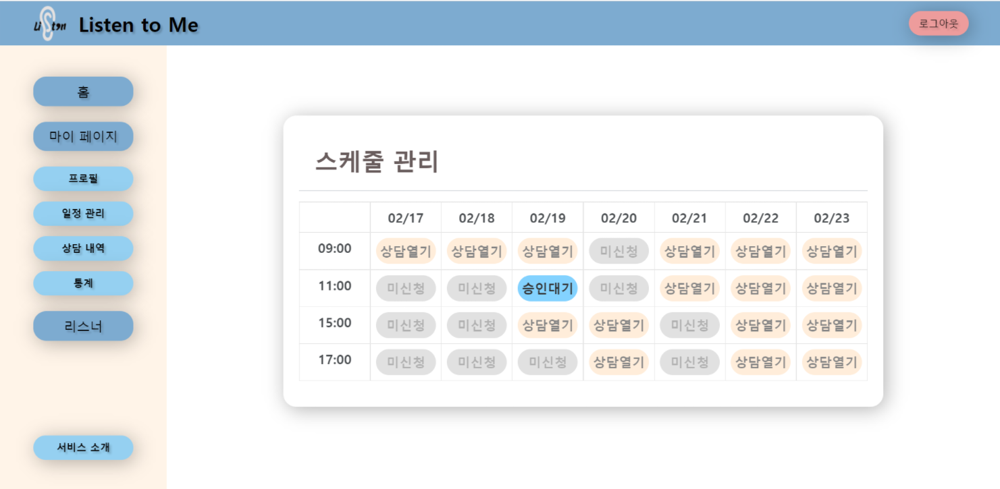

# Listen to ME

> 웹 기술을 활용한 치유상담 플랫폼

<br>

## 📌 Intro

### 서비스 배경

- 코로나 블루로 인한 우울증, 무기력증 사례 증가
- 청년층 정신건강 상담이 급격하게 늘어남에 따라 마음 편하게, 가끔은 자신을 드러내지 않고 치유받을 수 있는 공간의 필요성 증대

- 언택트의 보편화

<br>

### 서비스 목표

#### 💙 당신의 마음을 치유하고 더불어 따뜻하고 희망찬 내일을 만드는 데 함께 하는 편안한 공간 💙

<br>

### 주요 타겟

유저는 크게 상담사(상담을 하는 자) / 내담자(상담을 받는 자)로 구분

- 상담사 
  - 코로나로 인해 대면상담이 어려워진 상담사들
  - 자율적으로 근무하고 싶은 상담사들
  - 언택트 시대에 맞게 재택근무를 원하는 상담사들
- 내담자
  - 주변 사람들에게 마음을 터놓기 어려워하는 사람들
  - 크고 작은 일들로 속앓이를 하는 사람들
  - 자신을 드러내지 않고 상담받기 원하는 사람들

<br>

### 팀 소개

👂 **공통프로젝트 6반 5팀**

|  이름  | 직책 |   역할   |               세부 역할                |
| :----: | :--: | :------: | :------------------------------------: |
| 김유민 | 팀장 | Backend  |       스케줄링 및 REST API 개발        |
| 노문택 | 팀원 | Frontend |       WEB-RTC, 서버&인프라 담당        |
| 박상현 | 팀원 | Frontend | 영상인식 및 감성분석, 스티커 기능 개발 |
| 심아윤 | 팀원 | Backend  |       WEB-RTC, 서버&인프라 담당        |
| 이수민 | 팀원 | Frontend | 로그인 및 회원관리, 스케줄링 기능 개발 |

<br>

### 기술 스택

    

  

- Backend:  Spring boot(maven), MySQL
- Frontend: Vue.js, face-api.js, chart.js, Openvidu
- DevOps: GitLab, Jenkins, Docker, JIRA, AWS

<br>

### 아키텍처


<br>

### ERD


<br>


## 💡 서비스 소개

> 개발 기간 : 2022.01.10 - 2022.02.18 (총 6주)

### 폴더 구조 - Frontend
```
📦src
 ┣ 📂api
 ┣ 📂assets
 ┃ ┣ 📂images
 ┃ ┗ 📜color-reference.png
 ┣ 📂components
 ┃ ┣ 📂accounts
 ┃ ┣ 📂basics
 ┃ ┣ 📂Counseling
 ┃ ┣ 📂listener
 ┃ ┣ 📂profile
 ┃ ┗ 📜MarkedCounselors.vue
 ┣ 📂router
 ┣ 📂store
 ┣ 📂views
 ┃ ┣ 📂accounts
 ┃ ┣ 📂counseling
 ┃ ┣ 📂listener
 ┃ ┣ 📂profile
 ┃ ┃ ┣ 📂client
 ┃ ┃ ┣ 📂counselor
 ┃ ┃ ┗ 📜RecordList.vue
 ┃ ┗ 📜Home.vue
 ┣ 📜App.vue
 ┗ 📜main.js
```

### 폴더 구조 - Backend
```
📦src
 ┣ 📂main
 ┃ ┣ 📂java
 ┃ ┃ ┗ 📂com
 ┃ ┃ ┃ ┗ 📂ssafy
 ┃ ┃ ┃ ┃ ┗ 📂a605
 ┃ ┃ ┃ ┃ ┃ ┣ 📂api
 ┃ ┃ ┃ ┃ ┃ ┃ ┣ 📂controller
 ┃ ┃ ┃ ┃ ┃ ┃ ┃ ┣ 📂Bookmark
 ┃ ┃ ┃ ┃ ┃ ┃ ┃ ┣ 📂Review
 ┃ ┃ ┃ ┃ ┃ ┃ ┃ ┣ 📂client
 ┃ ┃ ┃ ┃ ┃ ┃ ┃ ┣ 📂counselor
 ┃ ┃ ┃ ┃ ┃ ┃ ┃ ┣ 📂memo
 ┃ ┃ ┃ ┃ ┃ ┃ ┃ ┣ 📂statistics
 ┃ ┃ ┃ ┃ ┃ ┃ ┃ ┗ 📜ExceptionControllerAdvice.java
 ┃ ┃ ┃ ┃ ┃ ┣ 📂config
 ┃ ┃ ┃ ┃ ┃ ┣ 📂exception
 ┃ ┃ ┃ ┃ ┃ ┣ 📂interceptor
 ┃ ┃ ┃ ┃ ┃ ┣ 📂model
 ┃ ┃ ┃ ┃ ┃ ┃ ┣ 📂dto
 ┃ ┃ ┃ ┃ ┃ ┃ ┣ 📂entity
 ┃ ┃ ┃ ┃ ┃ ┃ ┣ 📂request
 ┃ ┃ ┃ ┃ ┃ ┃ ┃ ┗ 📂counselor
 ┃ ┃ ┃ ┃ ┃ ┃ ┗ 📂response
 ┃ ┃ ┃ ┃ ┃ ┃ ┃ ┣ 📂client
 ┃ ┃ ┃ ┃ ┃ ┃ ┃ ┣ 📂counselor
 ┃ ┃ ┃ ┃ ┃ ┃ ┃ ┣ 📂memo
 ┃ ┃ ┃ ┃ ┃ ┃ ┃ ┣ 📂review
 ┃ ┃ ┃ ┃ ┃ ┃ ┃ ┣ 📂schedule
 ┃ ┃ ┃ ┃ ┃ ┣ 📂repository
 ┃ ┃ ┃ ┃ ┃ ┣ 📂service
 ┃ ┃ ┃ ┃ ┃ ┗ 📜ListenToMeApplication.java
 ┃ ┗ 📂resources
 ┃ ┃ ┗ 📜application.properties
 ┗ 📂test
 ┃ ┗ 📂java
 ┃ ┃ ┗ 📂com
 ┃ ┃ ┃ ┗ 📂ssafy
 ┃ ┃ ┃ ┃ ┣ 📂a605
 ┗ ┗ ┗ ┗ ┗ ┗ 📜ListenTomeApplicationTests.java
```


### 로고 소개


Listen + 귀👂 + ' (쉼표)

- Listen + 👂 : 경청하다
- 쉼표 : 이야기를 하기위해, 듣기위해 쉬어가다

=> **소중한 당신의 이야기에 늘 귀 기울이다.**

<br>

### 실제 구현 서비스

- 메인화면


<br>

- 스케줄링

⭐ 상담사 상담 개설 -> 내담자 상담 신청 -> 상담사 상담 승인 -> 상담 진행





<br>

- 상담 중

⭐ 상담사는 상담 중 내담자의 감정분석 및 주요 사항 메모가 가능 / 내담자는 상담 내용 메모하여 추후해도 확인 가능하며 리뷰 작성 가능


<br>

- 통계

⭐ 상담사는 마이페이지 내 통계를 통해 내담자의 성별, 연령별 빈도 및 월별 상담수에 대한 정보를 확인하여 자가 피드백 가능


<br>

### 기대효과

상담사

- 감정분석을 통해 내담자의 감정을 파악하여 양질의 상담을 제공할 수 있다.

- 원하는 시간에 상담을 개설하여 보다 유연한 근무가 가능하다.
- 리뷰, 통계 등을 통해 스스로 피드백할 수 있다.
- 상담 시 이전에 남긴 메모를 통해 내담자에 대해 더 깊이 파악할 수 있다.

내담자

- 편안한 장소에서 편안한 마음으로 상담에 임할 수 있다.
- 자신이 원하는 상담사에게 상담을 신청하여 받을 수 있다.
- 남들의 시선에서 자유로워 심리적 부담없이 누구나 상담을 받을 수 있다.
- 필요 시 자신을 드러내지 않고 상담을 받을 수 있다.
- 이전 상담때 남긴 메모를 언제든 확인할 수 있어 상담의 효과를 극대화할 수 있다. 

<br>

### 서비스 상세보기

📑 상세 설명은 [WIKI](https://lab.ssafy.com/s06-webmobile1-sub2/S06P12A605/-/wikis/home) 에서 확인해주세요!
