# 시연 시나리오

### 📌 양방향 서비스 플랫폼의 특성으로 내담자/상담자 측면에서 각각 두 화면을 차례로 혹은 동시에 보여주며 시연 예정

------

#### 1. 스케줄링

상담사의 상담 개설 후 내담자의 상담 신청, 그 후 이를 보고 상담사가 상담을 승인하는 과정이 이뤄집니다.

👩‍⚕️ 상담사 - 상담 개설

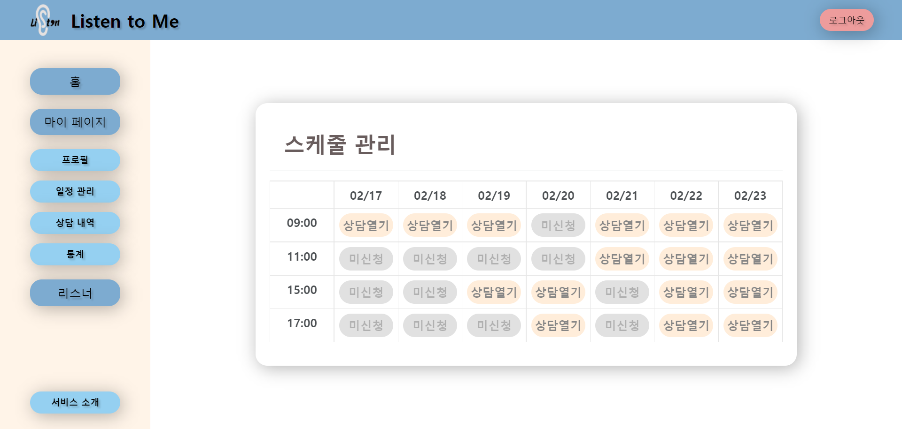

👩 내담자 - 상담 신청

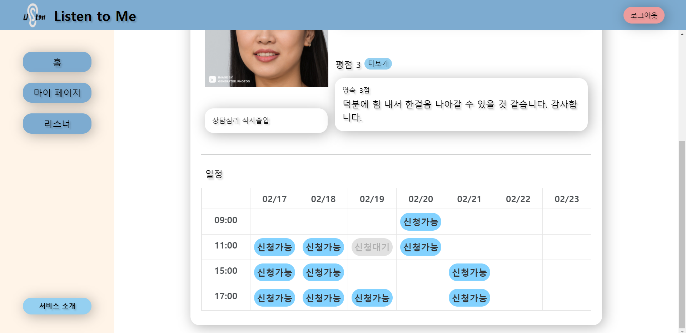

👩‍⚕️ 상담사 - 상담 승인

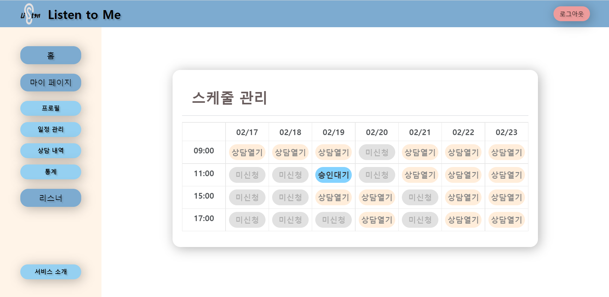

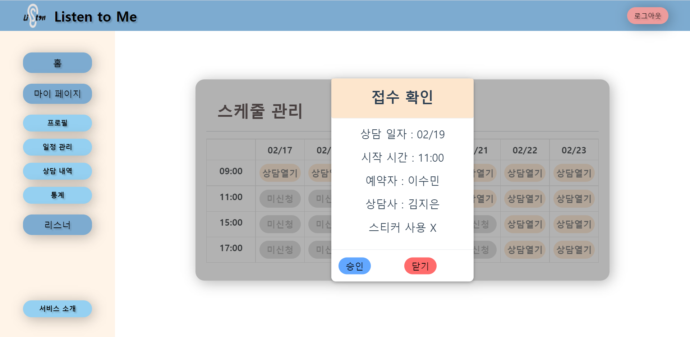

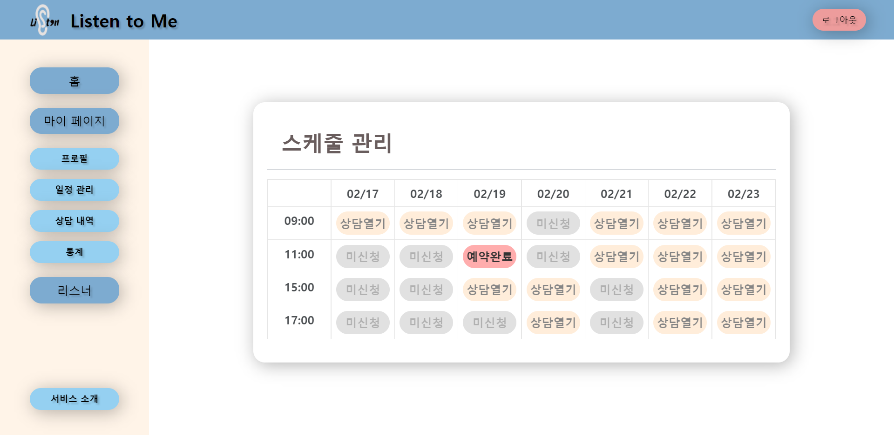

👩 내담자 - 상담 승인 확인

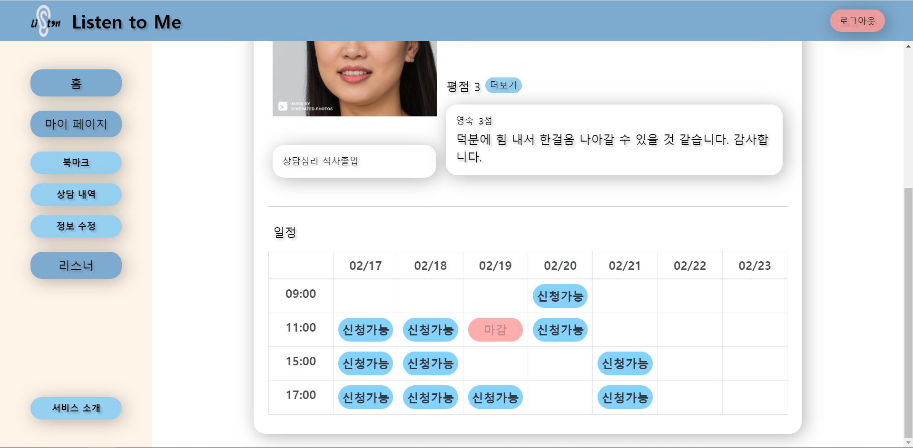

 

#### 2. 상담실 입장 및 상담 진행

👩‍⚕️ 상담사 - 상담실 입장

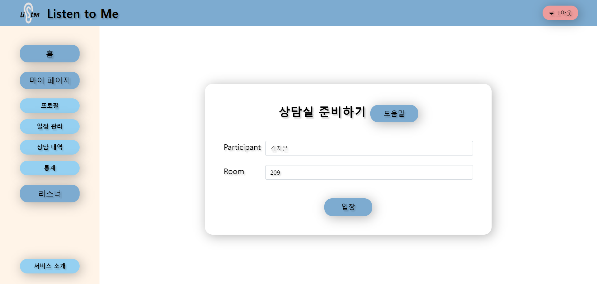

👩 내담자 - 상담실 입장

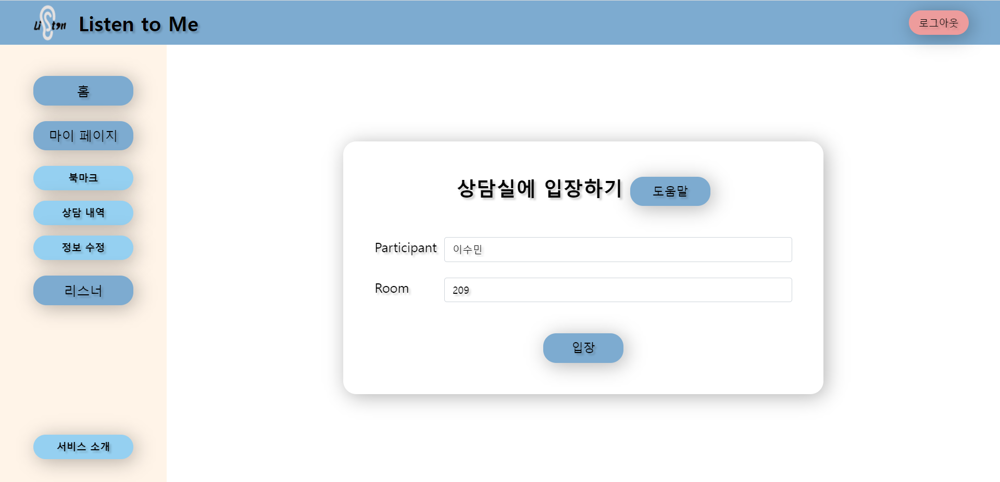

 

#### 3. 상담 중 감정 분석

👩‍⚕️ 상담사 - 상담 도중 감정분석을 통해 내담자의 감정을 파악

 

#### 4. 메모

👩‍⚕️ 상담사 - 상담 도중 메모를 통해 내담자에 대한 상세한 기록 남기기

👩 내담자 - 상담 도중 메모를 통해 상담 내용 기록하기

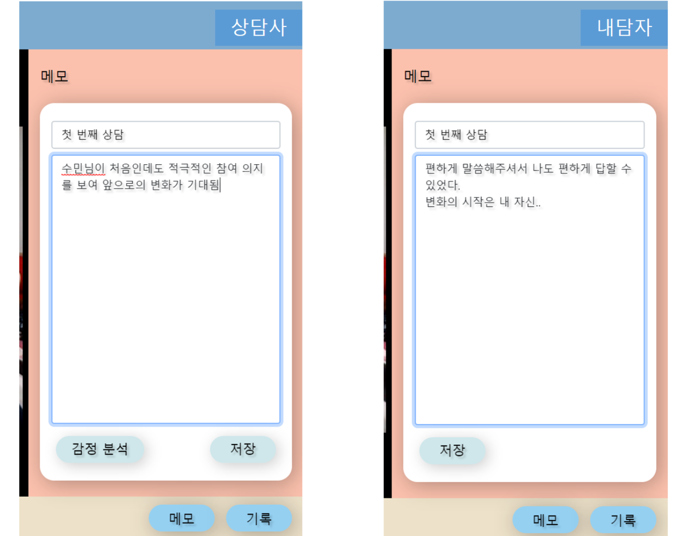

 

#### 5. 상담 종료 후 리뷰

👩 내담자 - 상담 종료 후 상담에 대한 리뷰 남기기

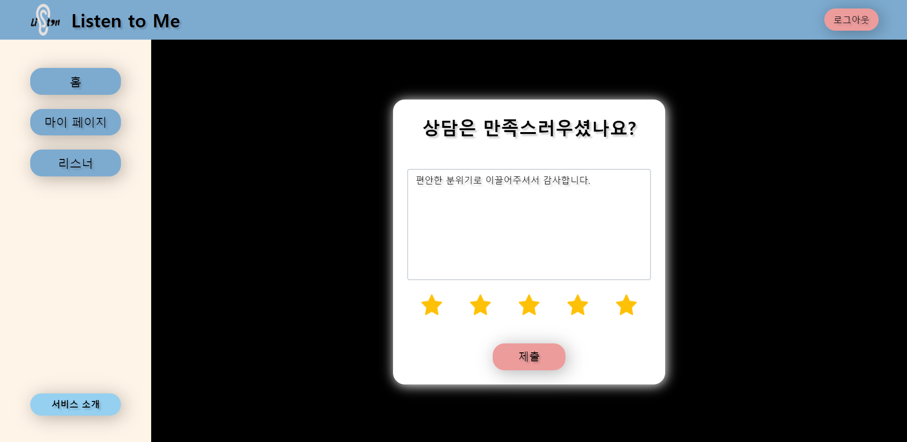

👩‍⚕️ 상담사 - 프로필에서 리뷰 확인 가능

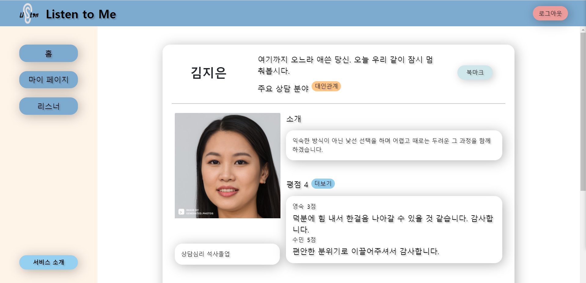

 

#### 6. 통계

👩‍⚕️ 상담사 - 마이페이지 내 통계를 통해 내담자의 성별, 연령별 빈도 및 월별 상담수에 대한 정보 확인 가능

